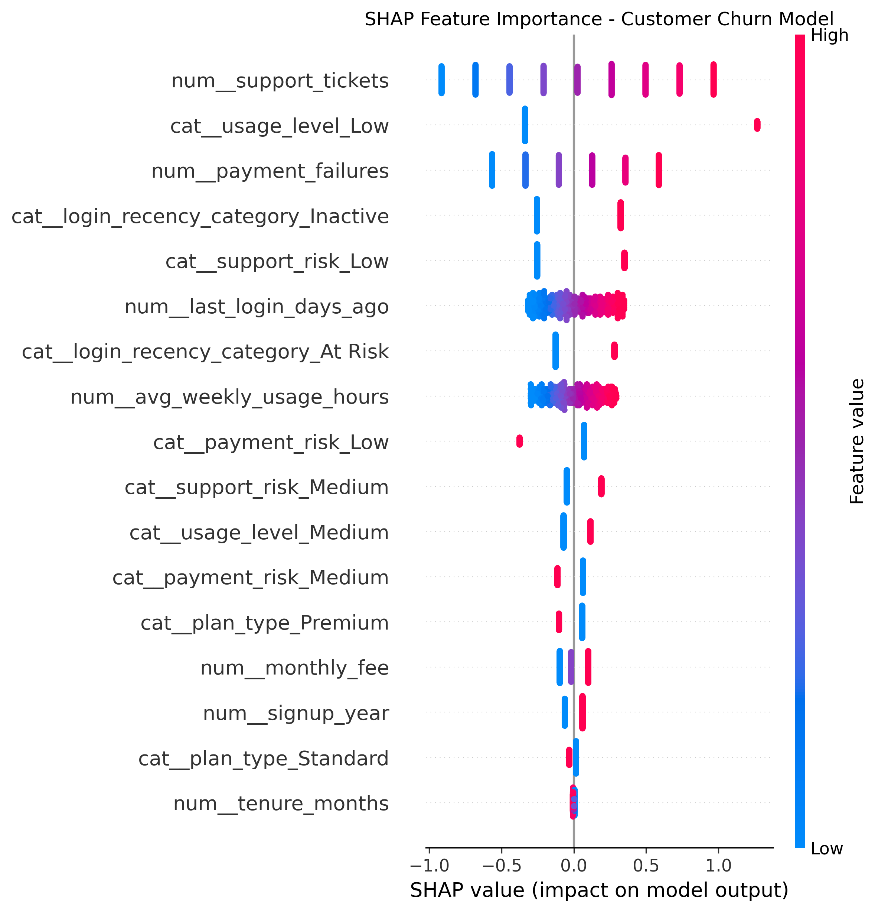

# AI Customer Churn Intelligence

An end-to-end customer churn intelligence system that combines **Machine Learning, SHAP Explainability, Large Language Models (LLMs), and Power BI** to predict customer churn, explain the key drivers, prioritize retention efforts, and generate actionable retention recommendations.

---

## 🎯 Project Overview

Customer churn is a major challenge for subscription-based businesses. Predicting which customers are likely to leave is useful, but prediction alone does not explain **why** a customer may churn or **what the business should do next**.

This project addresses that problem through an end-to-end AI-powered churn intelligence pipeline.

The system follows:

**Predict → Explain → Prioritize → Recommend → Visualize**

### The system provides:

- Customer churn probability prediction
- Customer risk classification
- SHAP-based model explainability
- Retention priority classification
- LLM-powered retention recommendations
- Customer-level drill-through analysis
- Interactive Power BI dashboard
- Business-focused customer insights

---

## 📈 Key Results & Business Impact

The system transforms customer-level churn predictions into actionable retention intelligence.

| Metric | Result |
|---|---:|
| High-Risk Customers | **1,327** |
| Predicted Churn Customers | **1,769** |
| Average Churn Probability | **57.19%** |
| Highest Example Churn Probability | **95.87%** |

### Business Insights

- Identifies customers with elevated predicted churn risk for proactive retention.
- Uses **SHAP values** to explain the key factors contributing to individual churn predictions.
- Converts model predictions into **Critical, High, Medium, and Low retention priorities**.
- Generates customer-specific retention strategies using an **LLM**.
- Enables business users to investigate individual customers through **Power BI drill-through analysis**.
---

## 🛠️ Tech Stack

| Category | Technologies |
|----------|--------------|
| **Programming** | Python, SQL |
| **Data Analysis** | Pandas, NumPy, Jupyter Notebook |
| **Machine Learning** | Scikit-learn, Logistic Regression |
| **Explainable AI** | SHAP |
| **Generative AI** | LLMs, OpenRouter |
| **Database** | SQLite |
| **Business Intelligence** | Power BI, DAX, Power Query |
| **Data Visualization** | Matplotlib, Seaborn, Power BI |
| **Version Control** | Git, GitHub | 

## 🏗️ System Architecture

```text
Customer Data
      │
      ▼
Data Cleaning & Feature Engineering
      │
      ▼
SQL Business Analysis
      │
      ▼
Machine Learning Model
      │
      ├──────────────► Churn Probability
      │
      ▼
SHAP Explainability
      │
      ├──────────────► Top Churn Drivers
      │
      ▼
Risk Classification
      │
      ▼
Retention Priority
      │
      ▼
LLM Retention Recommendations
      │
      ▼
Power BI Dashboard
```
---

## 🔬 Methodology

### 1. Data Understanding & EDA

Explored the customer dataset to understand customer behavior, churn patterns, numerical distributions, and categorical variables.

### 2. Data Cleaning & Feature Engineering

Prepared the data for machine learning by handling preprocessing requirements, transforming numerical and categorical features, and creating model-ready features.

### 3. SQL Business Analysis

Performed SQL-based analysis to identify customer behavior patterns, churn-related trends, and business insights that support retention decisions.

### 4. Machine Learning

Built and evaluated a **Logistic Regression classification pipeline** using Scikit-learn to estimate customer churn probability.

The pipeline includes preprocessing for numerical and categorical features and produces a customer-level churn probability that is subsequently used for risk classification and retention prioritization.

### 5. SHAP Explainability

Applied **SHAP (SHapley Additive exPlanations)** to explain individual churn predictions.

For each customer, SHAP identifies the features that contribute positively or negatively to the model's prediction.

This makes the churn model more interpretable for business users.

### 6. Risk Classification & Retention Priority

Converted predicted churn probabilities into actionable customer risk categories and retention priorities.

This allows the business to focus retention efforts on customers with higher predicted churn risk.

### 7. LLM-Powered Retention Recommendations

Used an LLM through **OpenRouter** to transform customer churn information and SHAP drivers into structured retention recommendations.

The generated recommendations include:

- Churn assessment
- Key churn reasons
- Retention actions
- Priority
- Business explanation

### 8. Power BI Intelligence Dashboard

Integrated the model outputs, SHAP explanations, and customer-level information into an interactive Power BI dashboard.

The dashboard supports filtering, risk analysis, and customer-level drill-through for business decision-making.
---
---

## 🧠 SHAP Explainability

The project uses **SHAP (SHapley Additive exPlanations)** to interpret individual customer churn predictions.

For each customer, SHAP values indicate how individual features contribute to the model's predicted churn risk.

### Example Customer Explanation

For a high-risk customer with a predicted churn probability of **95.87%**, the strongest model drivers included:

| Feature | SHAP Contribution | Interpretation |
|---|---:|---|
| Usage Level — Low | **+1.2683** | Strong positive contribution to predicted churn risk |
| Support Tickets | **+0.9662** | Increased model-predicted churn risk |
| Payment Failures | **+0.5876** | Increased model-predicted churn risk |
| Inactive Login | **+0.3244** | Contributed to higher predicted churn risk |
| Days Since Last Login | **+0.1820** | Contributed to higher predicted churn risk |

Negative SHAP contributions included:

| Feature | SHAP Contribution |
|---|---:|
| Low Support Risk | **-0.2537** |
| Average Weekly Usage Hours | **-0.2224** |

> **Note:** SHAP values explain the model's prediction and should not be interpreted as proof of causation.

### SHAP Feature Importance


---

## 🤖 LLM-Powered Retention Recommendations

The system uses an LLM through **OpenRouter** to convert customer churn predictions and SHAP-based risk factors into actionable retention strategies.

### Example Customer Recommendation

**Customer ID:** 2461

**Predicted Churn Probability:** 95.87%

**Priority:** Critical

#### Key Churn Reasons

- **Low usage level** — SHAP: **+1.2683**
- **Support tickets** — SHAP: **+0.9662**
- **Payment failures** — SHAP: **+0.5876**

#### Recommended Retention Actions

1. **Immediate outreach** to understand low product usage and explore suitable re-engagement options.
2. **Support ticket triage** to address the customer's reported issues.
3. **Payment support** to reduce payment friction and improve subscription continuity.

### Business Explanation

The customer has a very high predicted churn probability and several model-identified risk factors. The LLM converts these signals into practical retention actions that a business team can review and prioritize.

> **Note:** LLM-generated recommendations are decision-support outputs and should be reviewed by business users before being applied to customers.

## 📁 Project Structure

```text
AI-Customer-Churn-Intelligence/
│
├── data/
│   └── Customer churn datasets and dashboard-ready data
│
├── models/
│   └── LLM-generated customer retention recommendations
│
├── notebooks/
│   ├── 01_Data_Understanding_and_EDA.ipynb
│   ├── 02_Data_Cleaning_and_Feature_Engineering.ipynb
│   ├── 03_SQL_Business_Analysis.ipynb
│   ├── 04_ML_Modeling_and_Baseline.ipynb
│   ├── 05_SHAP_Explainability.ipynb
│   ├── 06_LLM_Retention_Recommendations.ipynb
│   ├── 07_AI_Churn_Intelligence_Pipeline.ipynb
│   └── customer_shap_explanations.csv
│
├── dashboard_images/
│   ├── 01_executive_overview.png
│   ├── 02_ai_risk_customer_intelligence.png
│   ├── 03_customer_intelligence_detail.png
│   └── shap_feature_importance.png
│
├── powerbi/
│   └── AI Customer Churn Intelligence.pbix
│
├── reports/
│   └── AI Customer Churn Intelligence.pdf
│
├── sql/
│   └── SQL business analysis queries
│
├── src/
│   └── Project source code and reusable components
│
├── .gitignore
├── README.md
└── requirements.txt
---

## 📊 Power BI Dashboard

### Executive Overview

The executive dashboard provides a high-level view of customer churn, including total customers, churn rate, churned customers, high-risk customers, and behavioral churn patterns.


### AI Risk & Customer Intelligence

This dashboard combines ML churn predictions, customer risk classification, churn probability distribution, retention priority, and customer-level risk factors.


### Customer Intelligence Detail

Customer-level analysis enables drill-through investigation of individual customers, their churn probability, risk category, behavioral factors, and retention priority.


---

## 📄 Project Report

A detailed project report covering the methodology, machine learning pipeline, SHAP explainability, LLM-based recommendations, and Power BI dashboard.

[View Project Report](reports/AI%20Customer%20Churn%20Intelligence.pdf)
